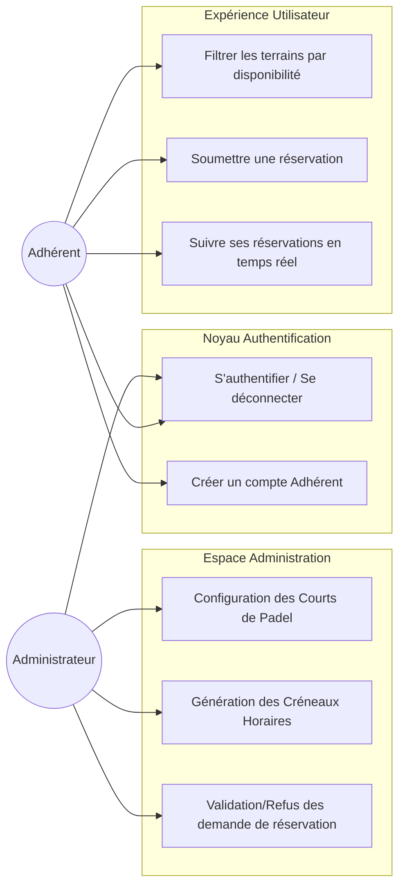
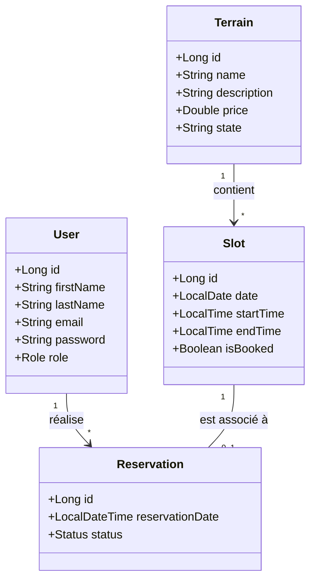

# RAPPORT DE PROJET DÉTAILLÉ : SYSTÈME DE RÉSERVATION PADEL

**Formation** : Mini-Projet Informatique (Full-Stack)
**Date** : Janvier 2026
**Responsable Pédagogique** : Dr.Ing Mohamed Amine MEZGHICH
**Développé par** : Mahdi Hemdane

---

## SOMMAIRE
1. [Introduction](#1-introduction)
2. [Analyse du Domaine et Besoins](#2-analyse-du-domaine-et-besoins)
3. [Conception & Modélisation UML (Approfondie)](#3-conception--modélisation-uml)
4. [Architecture Système et Stack Technique](#4-architecture-système-et-stack-technique)
5. [Réalisation du Backend (Spring Boot)](#5-réalisation-du-backend)
6. [Réalisation du Frontend (Angular)](#6-réalisation-du-frontend)
7. [Sécurité et Gestion des Accès (JWT)](#7-sécurité-et-gestion-des-accès)
8. [Conclusion et Perspectives](#8-conclusion-et-perspectives)

---

## 1. INTRODUCTION

### 1.1 Contexte Professionnel
Dans l'industrie du sport moderne, l'efficacité opérationnelle repose sur la capacité à automatiser les tâches répétitives. Le Padel, sport en pleine expansion, nécessite une gestion précise des ressources (terrains) et du temps (créneaux). Ce projet répond à ce besoin en offrant une solution robuste et scalable.

### 1.2 Problématique et Solution
La gestion manuelle par cahier ou tableur présente des risques de doublons, d'erreurs de saisie et une accessibilité limitée pour les clients. Notre solution propose une plateforme Web accessible 24h/24, garantissant une synchronisation parfaite entre les réservations des membres et la gestion administrative.

---

## 2. ANALYSE DU DOMAINE ET BESOINS

### 2.1 Analyse des Acteurs
- **Administrateur** : Super-utilisateur ayant un contrôle total sur l'inventaire physique (terrains) et temporel (slots). Il est le garant de la validation finale des réservations.
- **Adhérent** : Utilisateur final cherchant une expérience fluide pour trouver un terrain libre et le réserver en quelques clics.

### 2.2 Inventaire des Besoins Fonctionnels Détaillés
- **Gestion du Cycle de Vie des Terrains** : L'admin peut définir le type de gazon, l'éclairage et le prix horaire de chaque court.
- **Interactivité des Créneaux** : Chaque terrain est divisé en sessions (ex: 1h30). Un créneau est une entité atomique liée à une date et une plage horaire.
- **Flux de Réservation** : Un membre soumet une demande -> Le créneau passe en état "Pending" -> L'admin valide ou refuse -> Notification automatique.
- **Gestion de Profil** : Chaque utilisateur peut consulter et mettre à jour ses informations personnelles.

---

## 3. CONCEPTION & MODÉLISATION UML

### 3.1 Diagramme de Cas d'Utilisation (Use Case)
Le diagramme suivant détaille la séparation des responsabilités. L'authentification est le point d'entrée commun (include) pour toutes les actions sécurisées.

### 3.2 Diagramme de Classes (Model Data)
L'architecture des données repose sur une relation forte entre le Terrain, le Créneau (Slot) et la Réservation.

---

## 4. ARCHITECTURE SYSTÈME ET STACK TECHNIQUE

### 4.1 Architecture logicielle
Le projet suit une **architecture découplée** (Client-Serveur) :
- **Frontend** : Développé avec **Angular 16**, gère l'état de l'interface et l'expérience utilisateur.
- **Backend** : Un micro-service **Spring Boot 3** exposant une API REST JSON.
- **Persistence** : Base de données **MySQL** pour la robustesse relationnelle.

### 4.2 Technologies Clés
- **Hibernate (ORM)** : Transformation automatique des objets Java en tables SQL.
- **Spring Security** : Moteur de sécurité gérant les filtres de requêtes.
- **RxJS (Reactive Extensions)** : Utilisé côté Angular pour gérer les flux de données asynchrones (Observables).
- **JWT (Stateless Auth)** : Permet de ne pas stocker de session sur le serveur, favorisant la montée en charge.

---

## 5. RÉALISATION DU BACKEND (SPRING BOOT)

### 5.1 Structure du Code
Le backend est organisé en packages suivant les standards du marché :
- `entity/` : Définition des tables de la base de données.
- `repository/` : Interfaces Spring Data JPA pour les requêtes (CRUD).
- `controller/` : Points d'entrée de l'API recevant les requêtes HTTP.
- `security/` : Configuration de l'accès et des filtres JWT.

### 5.2 Logique de Réservation
Lorsqu'un utilisateur réserve, le système vérifie d'abord si le `Slot` n'est pas déjà `isBooked = true`. Une transaction est ouverte pour garantir l'atomicité de l'opération (soit tout est sauvegardé, soit rien en cas d'erreur).

---

## 6. RÉALISATION DU FRONTEND (ANGULAR)

### 6.1 Design Responsive avec Argon Dashboard
Nous avons intégré le thème **Argon Dashboard** qui repose sur Bootstrap 4. Cela permet d'avoir une application "Mobile First", ergonomique aussi bien sur ordinateur que sur smartphone.

### 6.2 Services et Intercepteurs
- **AuthService** : Gère les appels vers les endpoints `/api/auth/signin` et `signup`.
- **Intercepteur JWT** : Un script qui "intercepte" chaque requête HTTP sortante pour y injecter automatiquement le Token JWT s'il existe dans le stockage local.

---

## 7. SÉCURITÉ ET GESTION DES ACCÈS (JWT)

### 7.1 Processus d'Authentification
1. L'utilisateur envoie son email/password.
2. Le serveur valide et renvoie un **Token signé**.
3. Le Token contient le rôle (`ROLE_ADMIN` ou `ROLE_MEMBER`).
4. Le frontend décode le token pour afficher les menus appropriés.
5. Si un membre essaie d'accéder à `/admin`, le `Guard` d'Angular le redirige vers l'accueil.

---

## 8. CONCLUSION ET PERSPECTIVES

### Bilan Technique
L'objectif de créer une application complète, sécurisée et fonctionnelle est atteint. L'utilisation de Spring Boot et Angular a permis de maintenir une base de code propre et maintenable.

### Perspectives de Développement
1. **Module de Statistiques** : Ajouter des graphiques Highcharts/Chart.js pour visualiser les taux de remplissage des terrains par mois.
2. **Système de Crédits** : Permettre aux membres de recharger leur compte et de payer leurs réservations via un solde virtuel.
3. **Météo en temps réel** : Intégrer une API météo pour alerter l'utilisateur si le terrain (en extérieur) risque d'être indisponible.

---
**Document élaboré pour la soutenance finale de Mini-Projet.**
